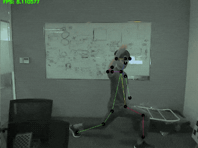

# Software and Machine Learning Project: Dectect "Hailing a cab" motion.
<!-- 
'Openpose' for human pose estimation have been implemented using Tensorflow. It also provides several variants that have made some changes to the network structure for **real-time processing on the CPU or low-power embedded devices.** -->

## Task
You and your partner must implement a system which, given a video stream from your webcam, detects a person who is hailing a cab. I.E if either hand is above the head, we should print "Someone is hailing a taxi!". 

All code edits should occur in `src/assignment.py`.

This assignment requires you to install external libraries in order to run someone else's code (which estimate pose). To do that you must follow the instructions below.

Once you have `assignment.py` running you must write your own python to detect when a taxi is hailed.

**hint:** when you see a `code snippet` you should run this in your command prompt

## 1. Install and Run the Software
## Get the Repo
You did this when you created your me repo, see the [Lab 1 slides](https://design-computing.github.io/md/week1#lab).  
1. *Fork* [this github repo](https://github.com/Design-Computing/tf-pose-estimation) 
2. *Clone* your forked repo
3. Change directory into your newly created repo `cd tf-pose-estimation`  

## Create an environment
In order to run the software you must install the dependencies in an [Anaconda Environment](https://docs.conda.io/projects/conda/en/latest/user-guide/concepts/environments.html):  
`conda create -n <NAME-YOUR-ENV> python=3.7`  
once you've created your environment you need to activate it:  
`conda activate <NAME-YOUR-ENV>`  
If your environment is active you should see the name of your env in the command prompt  
i.e. 
```bash 
(code-assgn1) C:/<YOUR_PATH>/tf-pose-estimation $
```
### Install Dependencies
Now you've created and activated your environment you need to install some import dependencies.
Type the following in your command prompt:  
```bash
pip install -r requirements.txt
pip install tensorflow
conda install -c menpo opencv
```

### Test Inference (one the dependencies are installed)

You can test the inference feature by capturing video from your webcam.

```
$ python src/assignment.py
```

<!-- Or if that doesn't whatever reason, test the inference feature with a single image.

```
$ python3 src/assignment.py --image=...
``` -->

Then you will see something like below, but with your own camera.



## Hail a Taxi
Edit `assignment.py` in the src folder so that you detect a taxi being hailed (any of your arms are raised)  
Read the code and TODOs in assignment.py. Uncomment the line:
```
print([(POSE_COCO_BODY_PARTS[k], v.x, v.y) for k,v in human.body_parts.items()])
```
and run it to see what happens.

## Marking 
In the following week you and your partner will present your cab hailing for marking by the end of the lesson.
You must also explain the logic of your code to your marker.

As this is a paired assignment, you must also learn how to code in a team using *git* with your partner.    
You and your partner will need to commit to your tf-pose-estimation repo **at least once**.  
You must also co-author a commit with your partner.  

## Submission
Create, commit, and push a file named **results.json**.  
This is a dictionary like file which contains:
1. a link to one of *your* commits
2. a link to one of your *partners* commits
3. a link to your *co-authored* commits
4. a screen shot of *you* cab hailing
5. a screen shot of your *partner* cab hailing

The **results.json** file should be commited and pushed as follows:
```json
{
"commit_me": "https://github.com/<YOUR-GITHUB>/tf-pose-estimation/commit/<thecommitSHA>",
"commit_partner": "https://github.com/<YOUR-GITHUB>/tf-pose-estimation/commit/<thecommitSHA>",
"commit_coauthor": "https://github.com/<YOUR-GITHUB>/tf-pose-estimation/commit/<thecommitSHA>",
"screenshot_me": "/path/to/your/screenshot.jpg",
"screenshot_partner": "/path/to/partner/screenshot.jpg"
}

```

## Deadline
19th of July 2019. Marking will be done in the labs on the day.
You must commit and push your results BEFORE the end of the lesson (2pm).
